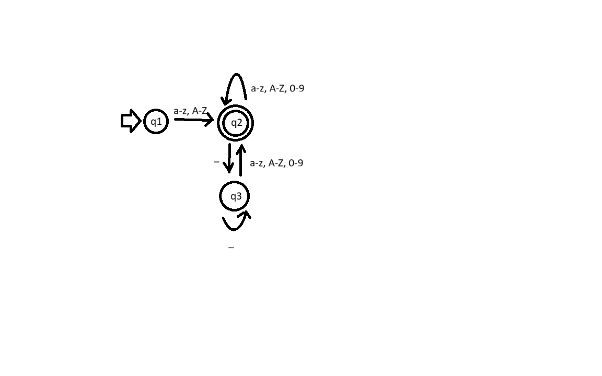
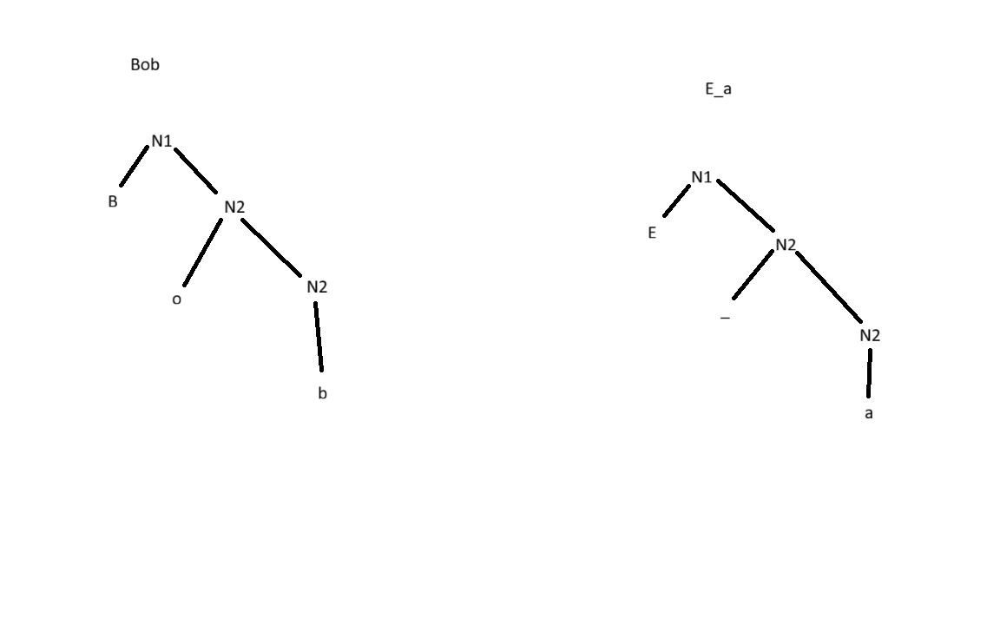
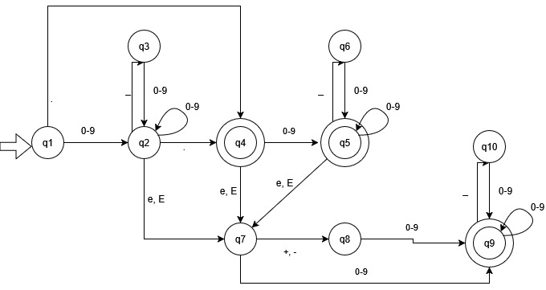
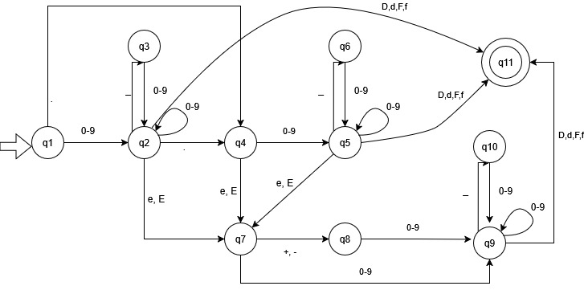
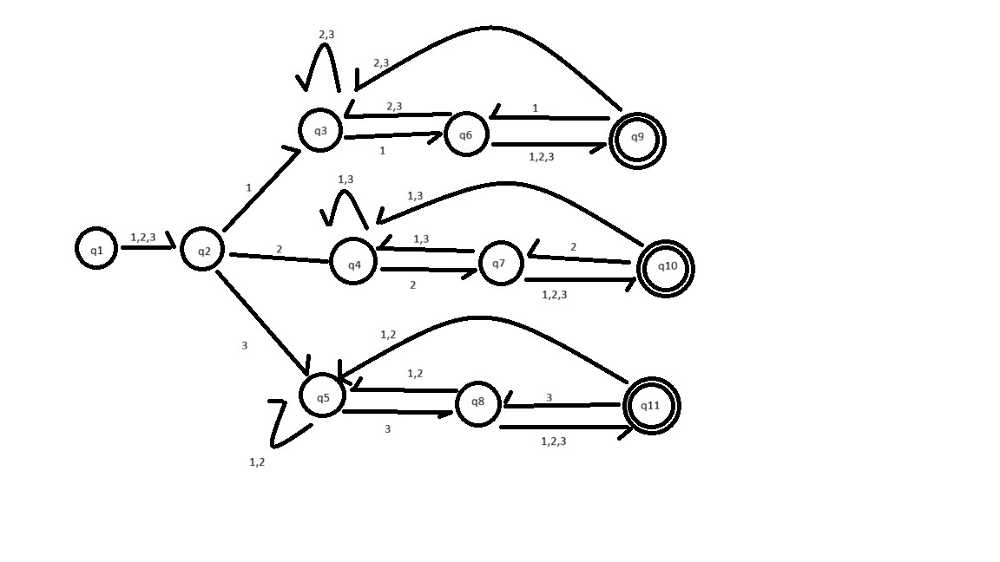

# Praktikum 1

## Task 1.1

Alle Worte sind entweder ein einzelnes a oder ein aa mit beliebig vielen a's oder b's dazwischen (z.B. aaa, aba, ababbbabbbabbba...)

## Task 1.2

### Regulärer Ausdruck

(a-z + A-Z)(a-z + A-Z + 0-9 + \_ )\*(a-z + A-Z + 0-9)

1. VPeta \
V = (a-z + A-Z) \
Pet = (a-z + A-Z + 0-9 + \_ )\* \
a = (a-z + A-Z + 0-9)

2. a\_RAmboss \
a = (a-z + A-Z) \
\_RAmbos = (a-z + A-Z + 0-9 + \_ )\* \
s = (a-z + A-Z + 0-9)

### DFA



1. Deutschland \
D = q1 -> q2 \
eutschlan = q2 -> q2 \
d = q2 -> q2

2. Die\_Kiste123 \
D = q1 -> q2 \
ie = q2 -> q2 \
\_ = q2 -> q3 \
K = q3 -> q2 \
iste12 = q2 -> q2 \
3 = q2 -> q2

### Grammatik

({N1,N2}, {a-z, A-Z, 1-9, \_}, P, N1) \
P: \
N1 -> a-zN2 | A-ZN2 \
N2 -> a-zN2 | A-ZN2 | 0-9N2 | \_N2 | a-z | A-Z | 0-9



## Task 1.3

### Python

In Python muss eine Gleitkommazahl entweder einen Punkt oder ein e/E enthalten. Nach einem e/E kann ein +/- folgen.
Die genauen Regeln sind in in der [Python Dokumentation](https://docs.python.org/3/reference/lexical\_analysis.html) nach zu lesen.

#### Python-Regex

((0-9)(\_(0-9))\* . (0-9) (\_(0-9))\* (((e + E)(+ + - + ε)) + ε) (0-9) (\_(0-9))\*) + \
(. (0-9) (\_(0-9))\* (((e + E)(+ + - + ε)) + ε) (0-9) (\_(0-9))\*) + \
((0-9) (\_(0-9))\* (e + E) (+ + - + ε) (0-9) (\_(0-9))\*)

#### Python-DFA



#### Python-reguläre Grammatik

({N1, N2, N3, N4, N5, N6, N7, N8, N9, N10}, {e, E, 0-9, \_, .}, P, N1) \
P: \
N1 -> 0-9N2 | .N4 \
N2 -> 0-9N2 | \_N3 | .N4 | eN7 | EN7 \
N3 -> 0-9N2 \
N4 -> 0-9N5 | eN7 | EN7 | ε \
N5 -> 0-9N5 | \_N6 | eN7 | EN7 | ε \
N6 -> 0-9N5 \
N7 -> 0-9N9 | +N8 | -N8 \
N8 -> 0-9N9 \
N9 -> 0-9N9 | \_N10 | ε \
N10 -> 0-9N9

### Java

Java speichert Gleitkommazahlen in zwei Varianten ab. Floates werden in 4Bytes abgespeichert und können bis zu ca. 7 Nachkommastellen darstellen. Doubles nutzen 8 Bytes und können somit doppelt so viele Nachkommastellen abspeichern, ca. 14 Stück.

#### Java-Regex

(((0-9)(\_(0-9))\* . (0-9) (\_(0-9))\* (((e + E)(+ + - + ε)) + ε) (0-9) (\_(0-9))\*) + \
(. (0-9) (\_(0-9))\* (((e + E)(+ + - + ε)) + ε) (0-9) (\_(0-9))\*) + \
((0-9) (\_(0-9))\* (e + E) (+ + - + ε) (0-9) (\_(0-9))\*))(d + F + d + D + ε)

#### Java-DFA



#### Java-reguläre Grammatik

({N1, N2, N3, N4, N5, N6, N7, N8, N9, N10}, {e, E, 0-9, \_, .}, P, N1) \
P: \
N1 -> 0-9N2 | .N4 \
N2 -> 0-9N2 | \_N3 | .N4 | eN7 | EN7 | dN11 | DN11 | fN11 | FN11 \
N3 -> 0-9N2 \
N4 -> 0-9N5 | eN7 | EN7 | ε \
N5 -> 0-9N5 | \_N6 | eN7 | EN7 | dN11 | DN11 | fN11 | FN11 | ε \
N6 -> 0-9N5 \
N7 -> 0-9N9 | +N8 | -N8 \
N8 -> 0-9N9 \
N9 -> 0-9N9 | \_N10 | dN11 | DN11 | fN11 | FN11 | ε \
N10 -> 0-9N9 \
N11 -> ε

## Task 1.4

### Warum ist der Regex ungeeignet?

- Schreibweise a-z ungeeignet (siehe Aufgabe)
- akzeptiert keine Großbuchstaben
- Anfangsteil und Domain aktzepieren keine Zahlen
- nach dem @ kann nur ein einzelner Buchstabe gefolgt vom . und noch einem Buchstaben kommen (```aaa@gmail.com``` ist nicht möglich)

### Warum ist  a + b + c + … + z nicht richtig?

Da hier nicht alle Zahlen und alle Großbuchstaben mit inbegriffen sind.

Korrekt wäre: \
(a-z + A-Z + 0-9)\* @ (a-z + A-Z + 0-9)\* . (a-z + A-Z + 0-9)\*

## Task 1.5



## Task 1.6

Eine Sprache in der Worte immer mit einem a anfängt, mit einem da oder db endet und dazwischen beliebig viele b's, c's und dc's hat.

a(b+c+dc)\*d(a+b)
