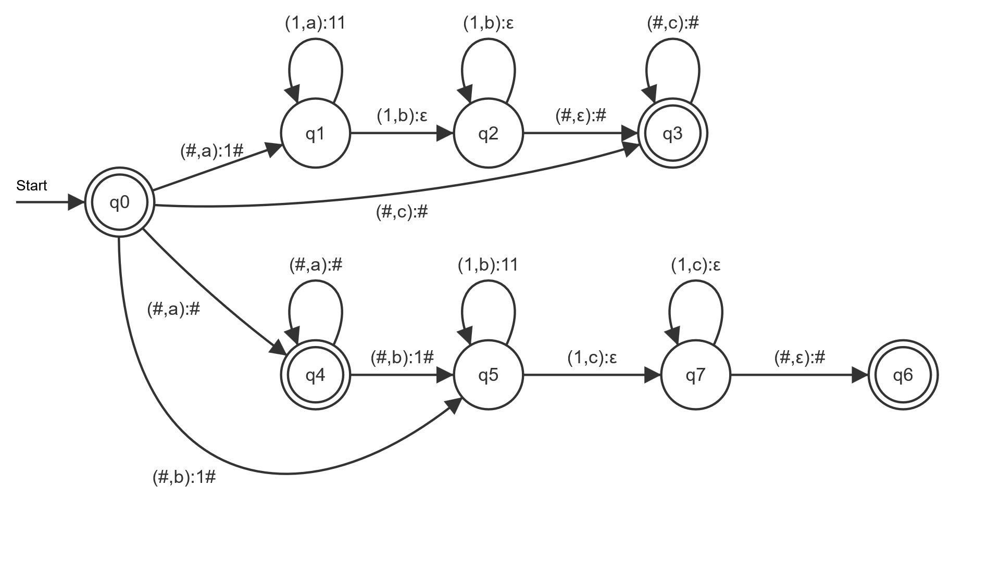

# Praktikum 2

## 1

Anmerkung: Die in den Übergängen angegebene Reihenfolge der auf den Stack zu legenden Keller-Buchstaben ist invertiert. D.h., dass der Buchstabe ganz links am Ende der Operation derjenige ist, der ganz oben auf dem Stack liegt.

### bcaba

b -> q2, Stack = [#  
c -> q1, Stack = [#, 1b, 1  
ϵ -> q0, Stack = [#, 1b, 1  
a -> q0, Stack = [#, 1b  
b -> q0, Stack = [#, 1b  
a -> q2, Stack = [#

### bccac

b -> q2, Stack = [#  
c -> q1, Stack = [#, 1b, 1  
ϵ -> q0, Stack = [#, 1b, 1  
c -> q1, Stack = [#, 1b, 1, 1, 1  
ϵ -> q0, Stack = [#, 1b, 1, 1, 1  
a -> q0, Stack = [#, 1b, 1, 1  
c -> q1, Stack = [#, 1b, 1, 1, 1, 1  
ϵ -> q0, Stack = [#, 1b, 1, 1, 1, 1

Endet in q0 -> Illegaler Zustand

## 2

### Nicht deterministisch

Der PDA ist nicht deterministisch, da er bei q3 zwei mögliche Wege bei $δ( q 3 , d , A )$ hat. einmal wird nur ein A aus dem Stack genommen und einmal wird ein zusätzliches A in den Stack geschreiben.

### Graph

Anmerkung: Die in den Übergängen angegebene Reihenfolge der auf den Stack zu legenden Keller-Buchstaben ist invertiert. D.h., dass der Buchstabe ganz links am Ende der Operation derjenige ist, der ganz oben auf dem Stack liegt.

### Tupel

$P = (Q,Σ,Γ,δ,q_0,⊥,F)$

$Q = \{q0,q1,q2,q3,q4\}$

$Σ = \{a,b,c,d\}$

$Γ = \{\#,A,B\}$

$δ = \{$
 $δ ( q 0 , a , ⊥ ) $->$ ( q 0 , A ⊥ ),$  
 $δ ( q 0 , a , A ) $->$ ( q 0 , A A ),$  
 $δ ( q 0 , b , A ) $->$ ( q 1 , B A ),$  
 $δ ( q 1 , b , B ) $->$ ( q 1 , B B ),$  
 $δ ( q 1 , c , B ) $->$ ( q 2 , ϵ ),$  
 $δ ( q 2 , c , B ) $->$ ( q 2 , ϵ ),$  
 $δ ( q 2 , d , A ) $->$ ( q 3 , ϵ ),$  
 $δ ( q 3 , d , A ) $->$ ( q 3 , ϵ ),$  
 $δ ( q 3 , d , A ) $->$ ( q 3 , A A ),$  
 $δ ( q 3 , ϵ , ⊥ ) $->$ ( q 4 , ϵ )$
$\}$

$q_0$ = q0

$⊥ = \#$

$F = \{q4\}$

### Sprache

$w = {a^2b^2c^2d^2}$

## 3

Die Sprache besteht aus endlosen Ketten an "if" und "else". Nach jedem if kommt eine undefinierte Condition. Nach jeder Condition kann ein "if" oder "else" kommen. Ein "else" kann erst nach einer unendlichen menge an "if" folgen. D.h. wenn wir nur die ersten n Zeichen eines Wortes der Sprache betrachten, dann wäre es in jedem Fall "if Condition if Condition if Condition ..."

Die Sprache ist nicht eindeutig:

Statement -> "if" Condition Statement -> "if" Condition "if" Condition Statement "else" Statement

ergibt das selbe wie

Statement -> "if" Condition Statement "else" Statement -> "if" Condition "if" Condition Statement "else" Statement

## 4

G = ({N0, N1, N2, N3, N4}, {a, b, c}, P, N0)

P={
N0 -> N1N3 | N4N2  
N1 -> aN1b | ϵ  
N2 -> bN2c | ϵ  
N3 -> cN3 | ϵ  
N4 -> aN4 | ϵ  
}

Die Grammatik ist mehrdeutig da z.B:  
N0-> N1N3 -> aN1bcN3 -> abc  
N0 -> N4N2 -> aN4bN2c -> abc

Anmerkung: Die in den Übergängen angegebene Reihenfolge der auf den Stack zu legenden Keller-Buchstaben ist invertiert. D.h., dass der Buchstabe ganz links am Ende der Operation derjenige ist, der ganz oben auf dem Stack liegt.
