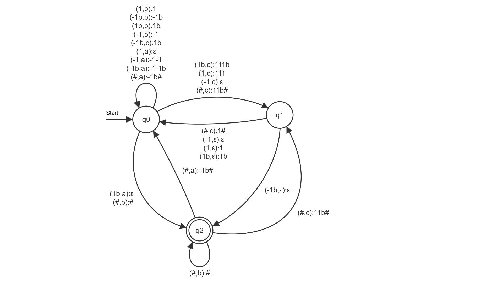

# Praktikum 2

## 1

Anmerkung: Die in den Übergängen angegebene Reihenfolge der auf den Stack zu legenden Keller-Buchstaben ist invertiert. D.h., dass der Buchstabe ganz links am Ende der Operation derjenige ist, der ganz oben auf dem Stack liegt.

### bcaba

b -> q2, Stack = [#
c -> q1, Stack = [#, 1b, 1
ϵ -> q0, Stack = [#, 1b, 1
a -> q0, Stack = [#, 1b
b -> q0, Stack = [#, 1b
a -> q2, Stack = [#

### bccac

b -> q2, Stack = [#
c -> q1, Stack = [#, 1b, 1
ϵ -> q0, Stack = [#, 1b, 1
c -> q1, Stack = [#, 1b, 1, 1, 1
ϵ -> q0, Stack = [#, 1b, 1, 1, 1
a -> q0, Stack = [#, 1b, 1, 1
c -> q1, Stack = [#, 1b, 1, 1, 1, 1
ϵ -> q0, Stack = [#, 1b, 1, 1, 1, 1

Endet in q0 -> Illegaler Zustand

## 2

## 3

## 4
