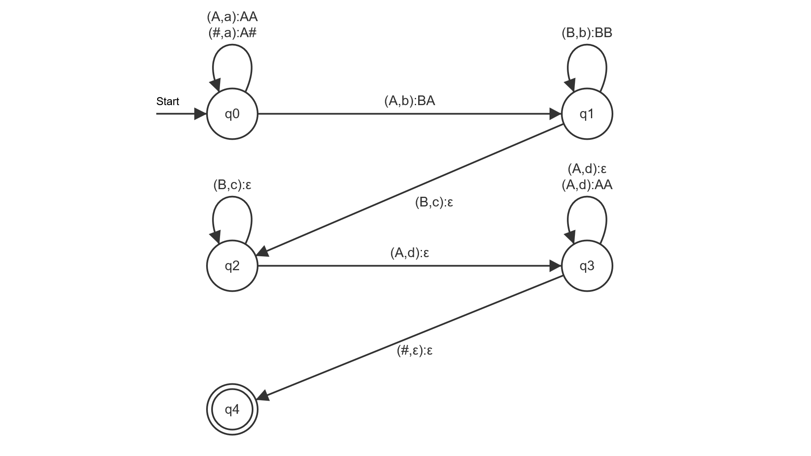

# Praktikum 2

## 1

Anmerkung: Die in den Übergängen angegebene Reihenfolge der auf den Stack zu legenden Keller-Buchstaben ist invertiert. D.h., dass der Buchstabe ganz links am Ende der Operation derjenige ist, der ganz oben auf dem Stack liegt.

### bcaba

b -> q2, Stack = [#
c -> q1, Stack = [#, 1b, 1
ϵ -> q0, Stack = [#, 1b, 1
a -> q0, Stack = [#, 1b
b -> q0, Stack = [#, 1b
a -> q2, Stack = [#

### bccac

## 2

### Nicht deterministisch
Der PDA ist nicht deterministisch, weil er bei q3 zwei mögliche Wege bei $δ( q 3 , d , A )$ hat. einmal wird nur ein A aus dem Stack genommen und einmal wird ein zusätzliches A in den Stack geschreiben. Wobei das entfernen von $δ ( q 3 , d , A ) $->$ ( q 3 , A A )$ die Sprache nicht verändern würde.

### Graph

### Tupel
$P = (Q,Σ,Γ,δ,⊥,F)$

$Q = \{q0,q1,q2,q3,q4\}$

$Σ = \{a,b,c,d\}$

$Γ = \{\#,A,B\}$

$δ = \{$
 $δ ( q 0 , a , ⊥ ) $->$ ( q 0 , A ⊥ ),$  
 $δ ( q 0 , a , A ) $->$ ( q 0 , A A ),$  
 $δ ( q 0 , b , A ) $->$ ( q 1 , B A ),$  
 $δ ( q 1 , b , B ) $->$ ( q 1 , B B ),$  
 $δ ( q 1 , c , B ) $->$ ( q 2 , ϵ ),$  
 $δ ( q 2 , c , B ) $->$ ( q 2 , ϵ ),$  
 $δ ( q 2 , d , A ) $->$ ( q 3 , ϵ ),$  
 $δ ( q 3 , d , A ) $->$ ( q 3 , ϵ ),$  
 $δ ( q 3 , d , A ) $->$ ( q 3 , A A ),$  
 $δ ( q 3 , ϵ , ⊥ ) $->$ ( q 4 , ϵ )$   
$\}$

$q_0$ = q0

$⊥ = \#$

$F = \{q4\}$

### Sprache

$w = {a^2b^2c^2d^2}$
## 3

## 4